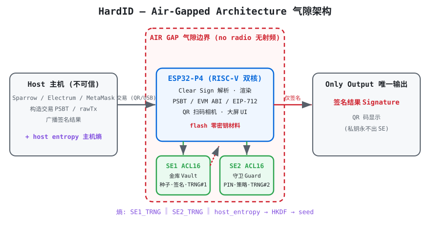

# HardID Hardware Wallet

**A fully open-source, air-gapped hardware wallet built around two EAL6+ secure elements — designed so your keys never touch an internet-connected chip.**

完全开源、气隙隔离的硬件钱包：私钥全生命周期不出安全芯片，所见即所签（Clear Sign）。

[](https://github.com/lightningasic/HardID/actions/workflows/host-tests.yml)
[](LICENSE)

<p align="center">
  
</p>

---

## 🎯 HardID 三原则 · The Three Principles

> 这三条原则是 HardID 的灵魂，凌驾于一切工程决策之上。任何与安全模型的冲突，以这三条为准。
> *These three principles are the soul of HardID and override every engineering decision.*

<p align="center">
  &nbsp;&nbsp;&nbsp;&nbsp;
  &nbsp;&nbsp;&nbsp;&nbsp;
  
</p>

---

###  完全开源 · Fully Open Source

| 中文 | English |
|------|---------|
| 固件、硬件原理图、主机端工具**全部开源**，支持**可复现构建**——任何人都能编译出与发布版逐字节一致的固件并比对哈希。 | Firmware, schematics and host tools are **fully open**, with **reproducible builds** — anyone can compile a bit-for-bit identical firmware and verify the hash. |
| **没有信任，只有验证。** | **Don't trust, verify.** |
| 全部代码 clean-room 重写，零 TREZOR 代码、零 Ms-RSL 合规风险 → [THIRD_PARTY_NOTICES.md](THIRD_PARTY_NOTICES.md) | All code is a clean-room rewrite — zero TREZOR code, zero Ms-RSL risk → [THIRD_PARTY_NOTICES.md](THIRD_PARTY_NOTICES.md) |
| Apache 2.0 许可证（含明确专利授权条款） | Apache 2.0 license with an explicit patent grant |

###  最简硬件 + 最高随机数要求 · Minimal Hardware, Maximal Entropy

| 中文 | English |
|------|---------|
| 硬件设计**极致精简**以最小化攻击面，但随机数生成**绝不让步**。 | Hardware is **minimal** to shrink the attack surface, but entropy quality is **non-negotiable**. |
| 主控只跑逻辑，**私钥全在 EAL6+ 安全芯片**，主控 flash 零密钥材料。 | The MCU only runs logic — **keys live in the EAL6+ secure element**; zero key material in MCU flash. |
| **双独立 TRNG + 主机熵，HKDF 混合**——任一熵源失效或被操控都不致命。 | **Two independent TRNGs + host entropy, mixed via HKDF** — no single failed or manipulated source is fatal. |
| **NIST SP 800-90B** 熵源评估 + **启动自检**：熵源不健康，设备拒绝生成任何密钥。 | **NIST SP 800-90B** entropy assessment + **boot-time self-test**: an unhealthy source means no keys are ever generated. |
| 无射频（ESP32-P4 无 WiFi/蓝牙）= 天生气隙。 | No radio (ESP32-P4 has no WiFi/BT) = air-gapped by design. |

###  一切操作在钱包完成，只输出签名结果 · Keys Never Leave the Device

| 中文 | English |
|------|---------|
| 私钥的**生成、备份恢复、签名**全在设备内完成，通过**屏幕（手写触摸）**与用户交互；对外、对网络**只输出签名结果**。 | Key **generation, recovery and signing all happen on-device**, with user interaction via the **touchscreen**; only **signatures** ever leave for the host/network. |
| 私钥全生命周期不出安全芯片（SE）。 | Private keys never leave the secure element — not once, ever. |
| **Clear Sign 所见即所签**：签名前屏幕显示人类可读的交易意图，无法解析一律警告。 | **Clear Sign (WYSIWYS)**: the screen shows a human-readable intent before signing; anything unparseable triggers a warning. |
| 助记词仅屏幕显示一次（手写备份），**无任何形式的导出**。 | The mnemonic is shown on screen exactly once (write it down) — **no export of any form, ever**. |

---

## Why HardID

三原则如何落地解决现有钱包的软肋：

| 现有钱包的问题 | HardID 的对策 | 对应原则 |
|------|--------------|---------|
| 主控被物理提取（STM32 flash 提取，wallet.fail 已演示） | **私钥只存于 EAL6+ 安全芯片**，主控 flash 零密钥材料 | 原则 2、3 |
| 盲签钓鱼（ETH 十六进制看不懂就签） | **Clear Sign 透明签名**：设备本地解析交易，屏幕显示人类可读意图（收款方/金额/授权对象），无法解析一律警告 | 原则 3 |
| 熵源被操控/失效（milk sad 盗币） | **双独立 TRNG + 主机熵，HKDF 混合**，任一失效不致命；启动自检失败拒绝生成密钥 | 原则 2 |
| 设备"自毁"导致永久丢币 | **设计红线：绝对无自毁**。PIN 错误纯指数退避（无上限、掉电持久化），永不擦除 | 原则 3 |
| 供应链/后门 | **完全开源 + 可复现构建**：固件哈希公开比对，硬件原理图开放 | 原则 1 |

---

## Hardware

- **主控**: **ESP32-P4**（RISC-V 双核，**无射频** = 天生气隙，MIPI-CSI 相机扫 QR）
- **安全芯片**: **2× 航芯 ACL16**（EAL6+）
  - **SE1「金库」**: 种子、BIP32 密钥、ECDSA 签名
  - **SE2「守卫」**: PIN 验证+退避、签名限额策略、防降级计数器、出厂证明
- **通信**: QR 码气隙优先（相机扫入交易，屏幕 QR 输出签名）；USB 最小数据面

> 硬件选型分析见 [docs/05_硬件选型决策报告.md](docs/05_硬件选型决策报告.md)

---

## Security Model

安全模型是三原则在密码学与固件层的具体实现：

1. **私钥不出 SE** — 生成、存储、签名全在安全芯片内；只对外输出签名结果  *(原则 3)*
2. **Clear Sign (WYSIWYS)** — 显示与签名数据同源；未知合约调用强制警告+长按确认  *(原则 3)*
3. **RFC6979 确定性 nonce** — 消除 RNG 失败导致的密钥泄露，可公开验证无隐蔽通道  *(原则 2)*
4. **无自毁** — 指数退避（错误越多等待越久），永不擦除唯一私钥  *(原则 3)*
5. **解锁才能签名** — 签名前必须 PIN 解锁会话（第 16 轮审计强化的安全不变量）  *(原则 3)*
6. **可复现构建** — 任何人可编译并比对固件哈希  *(原则 1)*

完整威胁模型与安全原则：[docs/安全核心审核报告.md](docs/安全核心审核报告.md)

---

## Repository Layout

```
core/      17 个 clean-room 密码与安全模块 (Apache 2.0)
           rng, hkdf, seed, sha256/512, keccak, bip32, bip39, secp256k1,
           rfc6979, ecdsa, clearsign, eip712, psbt, base58, pin, policy, multisig, boot
hal/       硬件抽象层 (ESP32-P4 + 双 ACL16)
           se_transport (SPI/I2C), se_acl16 (APDU), se_composite (双SE路由), se_board
esp-idf/   ESP32-P4 固件工程 (ESP-IDF v5.2+)
fuzz/      解析器模糊测试 (ASan/UBSan)
tests/     22 个测试套件 + 16 对抗性测试用例
docs/      PRD / ERD / 时序图 / 工程文档 / 硬件选型 / 安全审计报告
```

**全部 clean-room 重写，零 TREZOR 代码**（Ms-RSL 合规风险为零）：
[THIRD_PARTY_NOTICES.md](THIRD_PARTY_NOTICES.md)

---

## Security Auditing

本项目经过 **25 轮递进式安全审计**，发现并修复 **38 个真实问题**（6 高危），全部通过对抗性测试验证：

- PSBT 手续费污染（输出映射误读 → fee 显示错误）
- SignPolicy 冷静期失效（劫持者可瞬时提额）
- SE 签名不检查解锁（无需 PIN 授权即可签名）
- 空 PIN 绕过、decode_erc20 越界读、fee 溢出回绕……

**报告**: [docs/SECURITY_AUDIT.md](docs/SECURITY_AUDIT.md)

```
17/17 测试套件 + 16 对抗用例 + fuzz ASan/UBSan 全程绿
```

---

## Build & Test

### Host tests (no hardware needed)

```bash
cd tests
for t in rng hkdf seed keccak sha512 bip39 base58 bip32 pin policy \
         clearsign multisig se psbt boot ecdsa eip712 \
         acl16 composite transport_esp32 transport_i2c board; do
  gcc -Wall -Wextra -O1 -o test_$t test_$t.c
  ./test_$t
done
```

### Parser fuzzing (ASan/UBSan)

```bash
cd fuzz && make && ./fuzz_parsers 100000
```

### Firmware (ESP32-P4, needs ESP-IDF v5.2+)

```bash
. ~/esp/esp-idf/export.sh
cd esp-idf
idf.py set-target esp32p4
idf.py build
idf.py -p /dev/ttyUSB0 flash monitor
```

详细说明见 [esp-idf/README.md](esp-idf/README.md)

---

## Documentation

| 文档 | 内容 |
|------|------|
| [PRD](docs/01_HardID_PRD_产品需求文档.md) | 产品需求、OKR、功能架构 |
| [ERD](docs/02_HardID_ERD_实体关系图.md) | 设备内状态实体（SE/FLASH/HOST 分层） |
| [时序图](docs/03_HardID_时序图文档.md) | 初始化/签名/PIN退避/升级/自动签名/多签流程 |
| [工程文档](docs/04_HardID_软件开发工程文档.md) | 系统架构、模块、构建、测试策略 |
| [硬件选型](docs/05_硬件选型决策报告.md) | ESP32-P4 + 双 ACL16 决策分析 |
| [安全核心审核](docs/安全核心审核报告.md) | 威胁模型与安全原则 v2 |
| [安全审计](docs/SECURITY_AUDIT.md) | 25 轮审计完整记录 |

---

## Status

- ✅ 密码与安全核心（17 模块，官方测试向量 + 独立实现交叉验证）
- ✅ 25 轮安全审计（38 问题修复）+ fuzzing
- ✅ 双 ACL16 HAL（传输/APDU/组合路由）+ ESP32-P4 传输层
- ✅ ESP-IDF 工程骨架
- ⏳ ACL16 操作码填充（待厂商数据手册）
- ⏳ UI / Clear Sign 主循环（待真机联调）

**License**: [Apache 2.0](LICENSE) — Copyright © 2026 LightningASIC / HardID contributors
