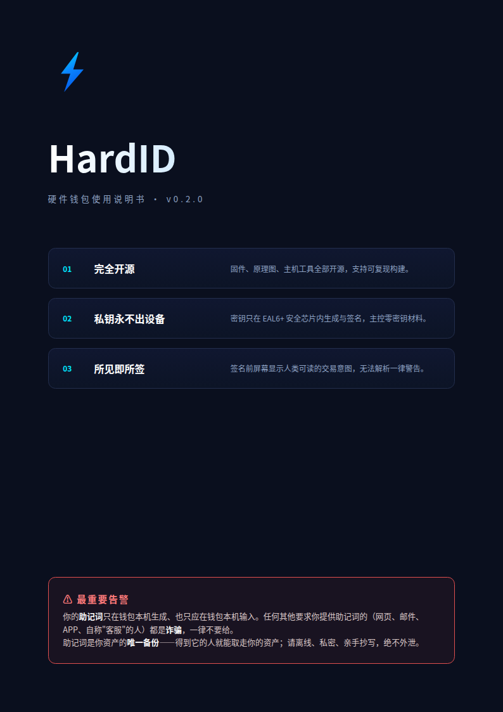

  

---

# HardID 硬件钱包 — 触摸屏使用说明书

版本：v0.2.0（交互式触摸屏固件，ESP32-S3）
适用硬件：微雪 Waveshare ESP32-S3-Touch-LCD-2（240×320 电容触摸屏，无物理按键）

> 本说明书与当前固件（HARDID_FW_VERSION **0.2.0**）逐项核对，内容描述的是**真机已实现**的行为。四语精简版见 `docs/manual/`（中文 / English / 日本語 / 한국어）。封面源文件 `docs/manual/cover-zh.html`，可用浏览器打开或重新渲染。

---

## 目 录

1. [安全须知（先读这一段）](#1-安全须知先读这一段)
2. [设备概览与主菜单](#2-设备概览与主菜单)
3. [初始化钱包](#3-初始化钱包)
4. [恢复钱包（RECOVER）](#4-恢复钱包recover)
5. [签名（SIGN）](#5-签名sign)
6. [主机链路（HOST LINK）](#6-主机链路host-link)
7. [FIDO 通行密钥](#7-fido-通行密钥)
8. [PIN 与自动锁定](#8-pin-与自动锁定)
9. [应用市场（APP MARKET）](#9-应用市场app-market)
10. [语言切换（LANGUAGE）](#10-语言切换language)
11. [关于（ABOUT）](#11-关于about)
12. [恢复出厂（FACTORY RESET）](#12-恢复出厂factory-reset)
13. [常见问题（FAQ）](#13-常见问题faq)
14. [功能矩阵](#14-功能矩阵)

---

## 1. 安全须知（先读这一段）

**在开始之前，请务必理解这三件最重要的事：**

- **你的加密资产永远不离开这台设备。** 私钥只在设备内生成、存储和用于签名，从不发送到电脑或网络。本设备永远不需要联网。
- **你的助记词（恢复短语）是你资产的唯一备份。** 丢失设备、没电、损坏时，只有助记词能重新生成钱包。**得到助记词的人就能取走你的资产**，所以它必须离线、保密、亲手抄写。
- **PIN 保护的是「别人不能用你的设备」。** PIN 不等于助记词。忘记 PIN 可以用助记词恢复；但助记词泄露则资产无救。

> ⚠️ **最重要告警：你的助记词只在钱包本机生成、也只应在钱包本机输入。任何其他要求你提供助记词的（网页、邮件、APP、自称"客服"的人）都是诈骗，一律不要给。**

**防伪造提示：**
- 全新设备首次开机，应显示主菜单，要求你主动「初始化」。
- 若设备收到时**已经预置了 PIN 或助记词**，说明可能被他人使用过，**不要使用**，应恢复出厂并重新初始化。

---

## 2. 设备概览与主菜单

| 项目 | 说明 |
|---|---|
| 屏幕与输入 | 240×320 电容触摸屏，全触控，**无物理按键** |
| 主菜单 | 开机直接进入主菜单 |
| 电源 | USB Type-C 供电（可边充边用） |

### 首次开机

通电后屏幕先显示产品 LOGO（splash），随后根据设备状态进入：

- **FIDO 已激活**：直接进入 **FIDO serving** 屏（设备即插即用，可被浏览器识别为安全密钥，如同 YubiKey）；点 **BACK** 才进入钱包主菜单。
- **FIDO 未激活**：依次经过 **PIN 解锁（如已设 PIN）→ 脑口令门（如已初始化）→ 主菜单**。

### 主菜单操作

主菜单**一次只显示一个菜单项**（大字高亮选框），下方有三个触摸键：**◀（左移）｜OK（确认）｜▶（右移）**。

- 用 **◀ / ▶** 移动选框，点 **OK** 或**轻点选框本身**进入该项；点其他区域无效（防误触）。
- **菜单随设备状态变化**：
  - 设备**已初始化**后，INITIALIZE / RECOVER 自动隐藏（它们只对空白设备有意义）；恢复出厂后重新出现。
  - FIDO 被删除后，FIDO 菜单项自动隐藏。

主菜单共 10 项（显示顺序）：

| # | 菜单项 | 说明 | 可见条件 |
|---|---|---|---|
| 0 | INITIALIZE | 生成新钱包（首次使用必做） | 仅空白设备 |
| 1 | RECOVER | 屏上键盘录入助记词恢复钱包 | 仅空白设备 |
| 2 | SIGN | 解锁并签名 | 已初始化 |
| 3 | HOST LINK | 服务电脑的签名请求（USB 链路） | 已初始化 |
| 4 | FIDO | 进入 FIDO 通行密钥服务 | 已安装 FIDO |
| 5 | APP MARKET | 安装/管理币种 App 与 FIDO | 始终 |
| 6 | PIN | 设置/修改 PIN 与自动锁定时间 | 始终 |
| 7 | ABOUT | 版本与硬件信息 | 始终 |
| 8 | LANGUAGE | 切换界面语言（英/中/日/韩） | 始终 |
| 9 | FACTORY RESET | 抹除设备全部数据 | 始终 |

---

## 3. 初始化钱包

初始化是生成新钱包并设置 PIN 的过程。**只有真正的新设备 / 已恢复出厂后**才能初始化；若设备已初始化，本功能会提示「已初始化」。

### 3.1 操作步骤

1. 在主菜单选 **INITIALIZE**。
2. **选择助记词长度**：点 **12**（128 位熵）或 **24**（256 位熵）按钮。24 词安全余量更大。（开发版另有 **4 WORDS (TEST)** 测试种子按钮，正式固件没有。）
3. **熵收集屏**（可选，推荐）：屏幕提示你**用手指按住屏幕任意位置**。按住时设备利用触摸坐标抖动采集额外随机熵，屏幕 3–2–1–0 倒计时后自动开始生成种子；或点 **SKIP**（跳过）直接开始。按住越久采到的随机性越多。
4. **种子安全告警**：读完后点 **I UNDERSTAND（我理解）** 继续。
5. **逐词抄写**：屏幕一次显示一个助记词，**拿出纸笔亲手抄写**，点 **Next** 看下一个词，直到抄完。
6. **二次确认（强制）**：按提示**逐词重输**整个助记词。只有与刚才显示的完全一致才继续；不一致**不会放行**，会要求重看词并重输。这是防止你抄错导致资产永久丢失的关键一步。
7. **设置 PIN（可选）**：询问是否设置 PIN——选 **Yes** 则输入 4–16 位数字 PIN 并二次确认；选 **No** 则钱包以无 PIN 方式运行（可之后随时在 PIN 菜单设置）。
8. 完成：屏幕显示 **Initialized OK**（种子已存储），点确认返回主菜单。

> **要点**：从第 3 步起保持手指按住直到倒计时完成，可最大化物理熵采样。

---

## 4. 恢复钱包（RECOVER）

1. 在主菜单（空白设备）选 **RECOVER**。
2. 出现**种子安全告警**，点 **I UNDERSTAND** 继续。
3. **屏上键盘逐词输入助记词**：
   - 输入 1–4 个字母，**当前缀唯一时自动补全整个单词**（BIP39 每个词由前 4 字母唯一确定）。
   - 键盘上方实时列出匹配候选词；屏幕顶部显示当前词序号 **WORD N**。
   - 点 **OK** 确认当前词，**Back** 退格。
4. 全部输完后设备校验**校验和**；助记词非法会被拒绝，**不会覆盖已有状态**。
5. 询问是否设置 PIN（可选，同上）。
6. 完成后显示 **Recovered**，种子已存储。

---

## 5. 签名（SIGN）

### 5.1 安全原则

签名**必须先在设备上解锁**：只有输对了 PIN，会话才解锁，否则设备拒绝签名。这条"设备解锁校验"是签名的安全不变式。**任何人，包括连接的电脑，都无法在你未输 PIN 的情况下让设备签名。**

### 5.2 操作流程

签名是**以币种 App 为中介**的：

1. 在主菜单选 **SIGN**。若只有一个可签名 App（如核心 BTC）则直接进入；有多个则进入 App 选择列表。
2. 如设备已设 PIN 且未解锁，先输入 PIN 解锁。
3. 出现**交易意图确认屏**，逐字段显示（所见即所签，WYSIWYS）：
   - 类型：`转账 / 代币转账 / 授权（approve）/ 合约调用 / 无法解析`；
   - 收款地址 `to …`；金额 `amount …`；`max fee …`；`chain id …`；合约 `method …`。
   - **无法解析（UNKNOWN）的交易**风险最高，需**连续两次**点 Yes 才能确认。
4. 点 **Yes** 签名，**No** 放弃。**签名永远只由 Yes/No 显式授权**，绝不会被随意一碰触发。

> 当前签名摘要是**真实链上 sighash**（EVM 按 EIP-155，BTC 系按 BIP143，已用官方测试向量校验）。签名最终组装（v/r/s、witness 注入）在主机侧完成。

---

## 6. 主机链路（HOST LINK）

HOST LINK 让**电脑上的钱包软件**通过 USB 请求设备签名：

1. 在主菜单选 **HOST LINK**（已初始化设备可见）。
2. 屏幕显示 **Host link serving**（等待数据帧）—— 设备进入"服务中"状态，等待电脑发送签名请求帧。
3. 电脑发送结构化 **SIGN 请求**（App id + BIP32 派生路径 + 原始交易字节）后，设备**独立重新解析**交易意图并显示在确认屏（与设备本机 SIGN 同一 WYSIWYS 确认屏），需你轻触确认后才签名。
4. 设备返回签名帧（EVM：一笔 r‖s；BTC：逐输入签名，主机侧组装 witness）。
5. 会话中点击屏幕底部 **BACK** 按钮退出（点其他区域不会退出）。退出后显示「会话结束」，再点一次确认。

> 帧协议、校验、Clear-Sign 确认门与签名服务已在固件中实现（`tests/test_linkproto.c` / `test_linksvc.c`）。USB 与主机间的实际联调需真机完成。

---

## 7. FIDO 通行密钥

FIDO 让设备充当 **FIDO2 / WebAuthn 安全密钥**（类似 YubiKey），用于网站通行密钥（passkey）的注册与登录。

- **出厂状态：已捆绑但未安装**。需先在 APP MARKET 激活（见第 9 节）；激活后主菜单出现 **FIDO** 项。
- **FIDO 免 PIN**：FIDO 授权 = 在设备上点 **Yes** 确认，**不要求钱包 PIN**（产品设计决定）。
- **开机即入**：FIDO 激活后**每次开机直接进入 FIDO serving 屏**（即插即用，如同安全密钥），点 **BACK** 才回到钱包主菜单。
- **使用**：FIDO serving 屏显示 **插到浏览器（plug into a browser）**——把设备 USB 连到电脑，在支持 passkey 的网站（如 GitHub）注册/登录，设备会弹出确认请求，点 **Yes** 授权。
- **退出**：点底部 **BACK**，显示「会话结束」后再点一次退出。
- **删除 FIDO**：APP MARKET → FIDO 行 → DELETE，**清除所有已注册的网站凭证**，主菜单 FIDO 项隐藏。删除/激活需要设备**已初始化**。

---

## 8. PIN 与自动锁定

### 8.1 PIN 菜单

主菜单 → **PIN**。屏幕显示两个选项：

1. **设置 / 修改 PIN**（`SET PIN` / `CHANGE PIN`）：选 OK 进入。
   - 已设 PIN 时**修改需先验证旧 PIN**，输错会提示 wrong PIN。
   - 输入 4–16 位数字 PIN，二次确认一致后保存（显示 PIN updated）。
   - **设置或修改 PIN 后设备立即重新锁定**，回到主菜单需再次输入。
2. **自动锁定时间**（`AUTO LOCK: …`）：选 OK 循环切换档位，实时生效：
   - **30s / 1min / 5min / 10min / Never（永不）**，默认 **5min**。

底部导航 `<` 在第一项时按 `<` 返回主菜单；`OK` 进入选中项；`>` 下移。

### 8.2 自动锁定行为

- 解锁后**空闲超过设定时间**自动重新锁定，回到主菜单任何操作前需再次输入 PIN。
- 自动锁定**只锁钱包**（签名/HOST LINK/解锁），FIDO 仍免 PIN。

### 8.3 开机流程

- 已设 PIN：开机后先显示 **Wallet locked**，输入正确 PIN 解锁。
- 未设 PIN：开机直接进入脑口令门 / 主菜单。

---

## 9. 应用市场（APP MARKET）

APP MARKET 管理**币种 App**（BTC/ETH 核心 + LTC/DOGE/BCH/ETC/POLYGON 等目录链）与 **FIDO**。

- **已安装列表**：显示已安装的 App（`[C]`=预装核心、`[+]`=可选安装；`!` 表示挂起状态），末尾有 **`+ INSTALL APP`**（安装新 App）入口。分页（每页 7 行，显示 `PAGE 1/2`）。
- **进入某 App**：选它点 OK → 显示该 App 详情页（**SIGN 签名** / **DELETE 删除**（仅可选 App）/ **BACK 返回**）。核心 App 不可删除。
- **安装新 App**：选 `+ INSTALL APP` → 进入 **Available（可安装）** 列表，选一个点 OK 安装。
- **FIDO 行**：已安装时显示在列表顶部（绿色），进入 FIDO 管理页可 **DELETE**（删除）或 **ACTIVATE**（激活）；未安装时在 Available 页可选装。
- 导航：底部 `<` / `OK` / `>`，或在列表上**直接轻点某行**进入。

---

## 10. 语言切换（LANGUAGE）

1. 主菜单选 **LANGUAGE**。
2. 屏幕列出四种语言：**English / 中文 / 日本語 / 한국어**（以各自本名显示）。
3. 用 **< / >** 移动选框，**OK** 确认。
4. 返回主菜单即全部界面以所选语言显示，**选择持久保存**（重启不丢）。

---

## 11. 关于（ABOUT）

显示设备信息，点任意处返回：

- **Chip**：ESP32-S3
- **Flash**：存储容量（MB）
- **Cores**：核心数
- **Firmware**：0.2.0
- **Build**：构建版本（git 提交，app 描述符，用于匹配精确源码构建）

---

## 12. 恢复出厂（FACTORY RESET）

**危险操作**：抹除设备内全部数据（种子、PIN、FIDO 凭证），**不可恢复**。

1. 主菜单选 **FACTORY RESET**。
2. 屏幕出现**输入确认**：屏上键盘**输入单词 `RESET`**，点 OK。
3. **再输一次 `RESET`**（双重确认，防止误触/旁观者误操作）。
4. 若设备已设 PIN，**输入 PIN 验证所有权**；PIN 错误则中止（显示 wrong PIN）。
5. 确认后设备抹除（显示 Device wiped），询问是否设置新 PIN，随后回到**出厂状态**：未初始化、FIDO 未安装、主菜单重新出现 INITIALIZE / RECOVER。

> 安全警示：此操作只发生在**设备屏幕上的确认**中，电脑无法远程触发。执行前请确认你已安全备份助记词。

---

## 13. 常见问题（FAQ）

**Q1：忘记 PIN 怎么办？**
用你的助记词恢复设备（先恢复出厂，再 RECOVER）并设置**新 PIN**。PIN 独立于助记词；没有助记词则无法找回资产。

**Q2：设备是否会联网？**
不会。设备离线工作，私钥永不离开硬件，也从不发送到主机或网络。

**Q3：助记词能发给客服/官方吗？**
**绝不能。** 任何人（包括自称客服/官方/修复人员）索取助记词都是诈骗。

**Q4：FIDO 需要 PIN 吗？**
不需要。FIDO 授权 = 在设备上点 Yes；PIN 只保护钱包签名。

**Q5：恢复出厂后就空了吗？**
是。种子、PIN、FIDO 凭证全部擦除，设备回到未初始化出厂态。

**Q6：如何判断设备是否被改装（二手）？**
参考第 1 节：设备应处于**未初始化**状态。若首次开机就要求 PIN 或展示已存在助记词，请勿使用并恢复出厂。

**Q7：为什么初始化时要按住屏幕？**
设备在利用触摸坐标抖动采集额外的物理随机熵（与芯片 TRNG、SE 熵混合），提高种子不可预测性。可以 SKIP，但按住更安全。

---

## 14. 功能矩阵

| 功能 | 触摸操作 | 当前状态 |
|---|---|---|
| 主菜单 | ◀ / OK / ▶ + 轻点选框 | ✅ 已实现（10 项，按状态显隐） |
| 初始化 · 12/24 词 | 按钮选择 | ✅ 已实现 |
| 初始化 · 熵收集（按住屏幕） | 长按 + 倒计时 | ✅ 已实现（可 SKIP） |
| 初始化 · 逐词抄写 + 强制二次确认 | 逐词重输 | ✅ 已实现（不一致不放行） |
| 恢复 · 候选词自动补全 | 键盘录入 | ✅ 已实现（前缀唯一即补全） |
| 签名 · WYSIWYS 确认屏 | Yes/No | ✅ 已实现（UNKNOWN 双确认） |
| 主机链路 HOST LINK | 确认屏 + BACK | ✅ 已实现（帧协议 host 已测） |
| FIDO · 通行密钥 | Yes 授权 + BACK | ✅ 已实现（FIDO2/WebAuthn，免 PIN） |
| FIDO · 删除/激活 | 管理页 | ✅ 已实现（删除清空凭证） |
| PIN · 设置/修改 + 自动锁定 | 键盘 + 循环档 | ✅ 已实现（30s–永不） |
| 应用市场 · 安装/删除 App | 列表导航 | ✅ 已实现（核心不可删） |
| 语言切换 | < / > / OK | ✅ 已实现（四语持久化） |
| 关于 | 显示 | ✅ 已实现（版本/硬件） |
| 恢复出厂 | 两次 RESET + PIN | ✅ 已实现（双重确认） |
| 种子安全告警 | I UNDERSTAND | ✅ 已实现 |

---

*本文档为开发期使用说明书，与固件 v0.2.0 逐项核对。请始终以「离线、私密、亲手抄写」三大原则保护你的资产。四语精简版见 `docs/manual/`。*